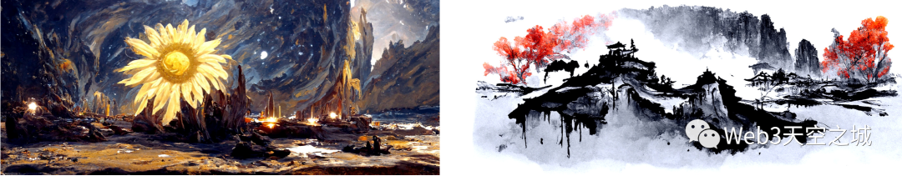

# AI绘画产品简介

### Disco Diffusion

Disco Diffusion 是在今年 2 月初开始爆红的一个 AI 图像生成程序，它可以根据描述场景的关键词渲染出对应的图像:

但Disco Diffusion的缺点还是有些明显，如身为专业艺术家的 Stijn Windig 反复尝试了Disco Diffusion，认为 Disco Diffusion 并没有取代人工创作的能力，核心原因有2点：
- Disco Diffusion 无法刻画具体细节，渲染出的图像第一眼很惊艳，但仔细观察就会发现大部分都是模糊的概括，达不到`商业细节水准`。
- Disco Diffusion的初步渲染时间是`以小时计算的`, 而要在渲染图像的基础上刻画细节，则相当于要把整个图重新画一遍，这样一个流程下来花耗费的时间精力，比直接手绘还要多。

### DALL·E 2代

到了今年4月, 著名人工智能团队OpenAI 也发布了新模型 DALL·E 2代，该名称来源于著名画家达利（Dalí）和机器人总动员（Wall-E）, 同样支持从文本描述生成效果良好的图像。

### MidJourney数字油画

而很多读者对AI绘画开始产生特别的关注, 或许是从以下这幅AI作品闹出的新闻开始的：

### Stable Diffusion