[toc]

# AI绘画发展历史

PS：本文内容来自于 [《AI绘画何以突飞猛进? 从历史到技术突破，一文读懂火爆的AI绘画发展史》](https://mp.weixin.qq.com/s/LsJwRMSqPXSjSyhoNgzi6w)

## 古典时代

### 70年代：机械臂作画时代

70年代，Harold Cohen（哈罗德·科恩，画家，加利福尼亚大学圣地亚哥分校的教授) 开发了一个"AARON"的绘画程序，它通过控制一个机械臂来进行作画。

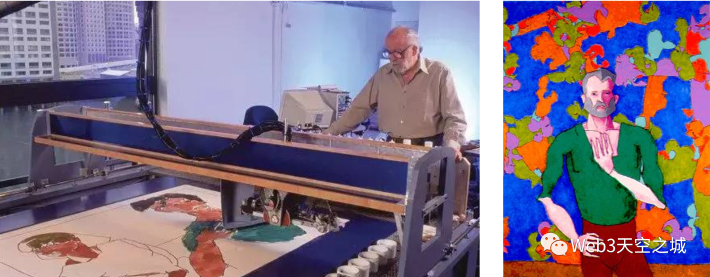

严格的说，这是一个机械控制程序，画家把自己对艺术的理解和表现方式通过程序来指导机械臂呈现在画布上。所以 ARRON 经过几十年的学习迭代，最后仍然只能产生色彩艳丽的抽象派风格画作（这正是 Harold Cohen 本人的抽象色彩绘画风）。

### 2006年：The Painting Fool

2006年，出现了一个类似ARRON的电脑绘画产品 The Painting Fool。它可以观察照片，提取照片里的块颜色信息，使用现实中的绘画材料如油漆，粉彩或者和铅笔等进行创作。

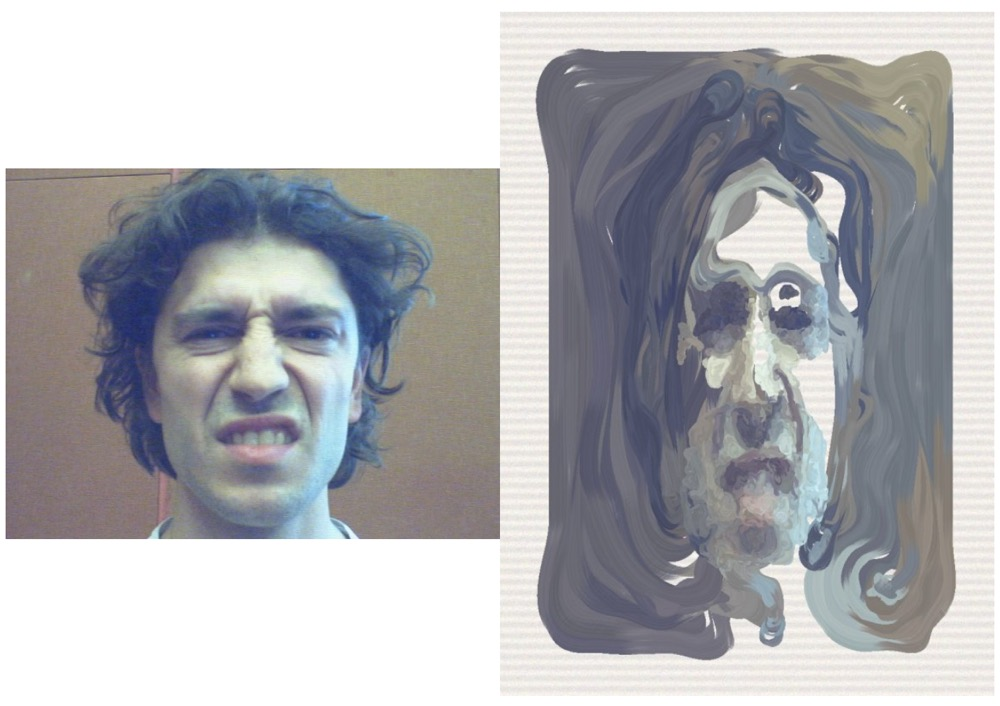
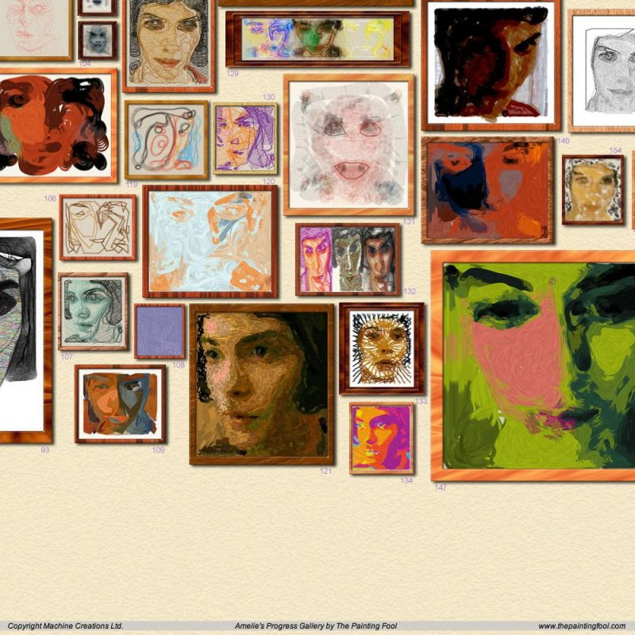

### 小结

现在我们所说的"AI绘画"概念，更多指的是基于深度学习模型来进行自动作图的计算机程序。而从上面2个例子可以看到，直到2006年为止，AI绘画的发展其实还是非常缓慢的，总体还是处于“古典”时代，并没有看到“AI”相关的技术实现。

## 深度学习时代

### 2012年：猫脸试验

2012年，Google两位AI大神 吴恩达 和 Jef Dean 进行了一场空前的试验，联手使用1.6万个CPU训练了一个当时世界上最大的深度学习网络，用来指导计算机画出猫脸图片。当时他们使用了来自youtube的1000万个猫脸图片，1.6万个CPU整整训练了3天，最终得到的模型，令人振奋的可以生成一个非常模糊的猫脸。

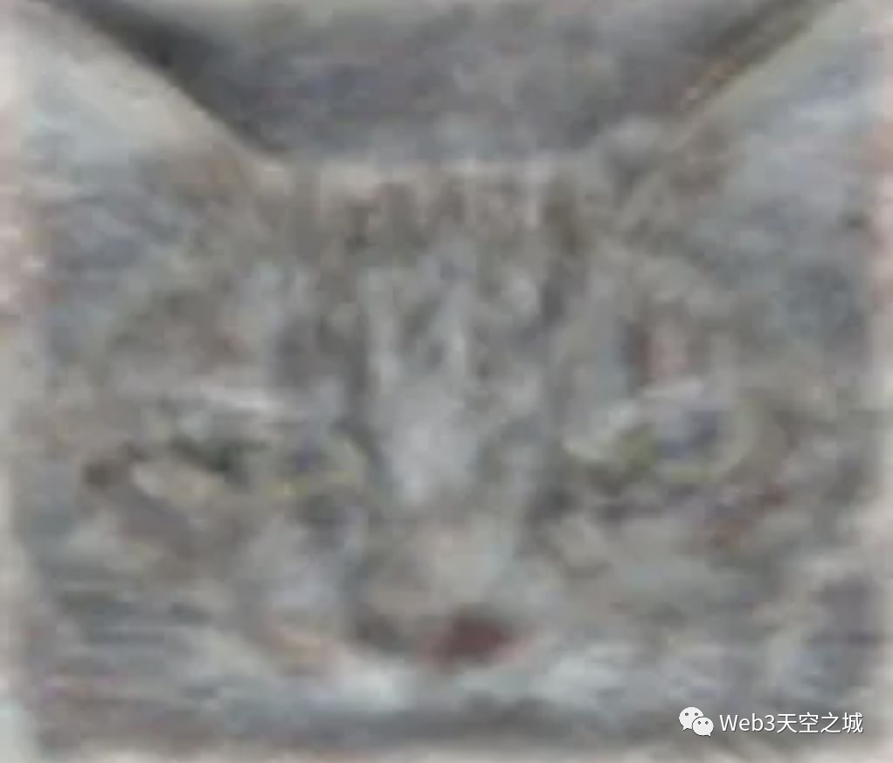

在今天看来，这个模型的训练效率和输出结果都不值一提。但对于当时的AI研究领域，这是一次具有突破意义的尝试，正式开启了 **深度学习** 模型支持的AI绘画这个"全新"研究方向，AI科学家们开始前赴后继投入到这个新的挑战性领域里。

### 2014年：对抗生成网络GAN

2014年，AI学术界提出了一个非常重要的深度学习模型，这就是大名鼎鼎的对抗生成网络GAN (Generative Adverserial Network)。

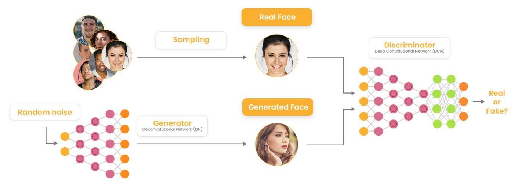

正如同其名字"对抗生成"，这个深度学习模型的核心理念是让两个内部程序 "生成器(generator)" 和"判别器(discriminator)" 互相PK平衡之后得到结果。

GAN模型一问世就风靡AI学术界，在多个领域得到了广泛的应用。它也随即成为了很多AI绘画模型的基础框架，其中 **生成器** 用来生成图片，而 **判别器** 用来判断图片质量，GAN的出现大大推动了AI绘画的发展。

但是，用基础的GAN模型进行AI绘画也有比较明显的缺陷：
- 对输出结果的控制力很弱，容易产生随机图像，而AI艺术家的输出应该是稳定的。
- 生成图像的分辨率比较低。

分辨率的问题还好说，GAN在"创作"这个点上还存在一个死结，这个结恰恰是其自身的核心特点：根据GAN基本架构，判别器要判断产生的图像是否和已经提供给判别器的其他图像是同一个类别的，这就决定了在最好的情况下，`输出的图像也就是对现有作品的模仿，而不是创新。`

### 2015年：Deep Dream

在对抗生成网络GAN之外，研究人员也开始利用其他种类的深度学习模型来尝试教AI绘画。

一个比较著名的例子是2015年 Google发布的一个图像工具深梦(Deep Dream)。深梦发布了一系列画作，一时吸引了很多眼球。谷歌甚至为这个深梦的作品策划了一场画展。

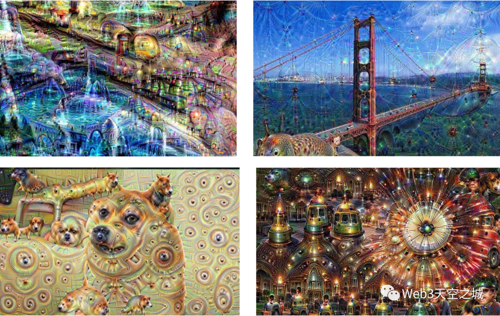

但如果较真一下，深梦与其说是AI绘画，更像是一个高级AI版滤镜，其滤镜风格一看上面的作品便可明白。

### 2017年：第一个开源简笔画模型

和Deep Dream相比，更靠谱的是Google在2017年（Google，[《A Neural Representation of Sketch Drawings》](https://arxiv.org/abs/1704.03477)）通过几千张手绘简笔画图片训练的一个模型，AI通过训练后能够绘制一些简笔画。

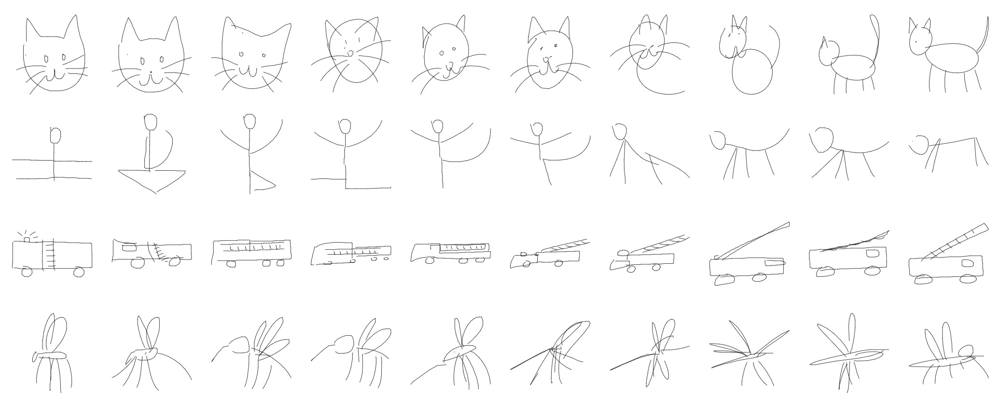

这个模型之所以受到广泛关注有一个原因，Google把相关源代码开源了（[sketch_rnn](https://github.com/magenta/magenta/tree/main/magenta/models/sketch_rnn)），因此第三方开发者可以基于该模型开发有趣的AI简笔画应用。一个在线应用叫做 “Draw Together with a Neural Network” ，随意画几笔，AI就可以自动帮你补充完整个图形。

### 2017年：创造性对抗网络CAN

值得注意的是，在AI绘画模型的研究过程中，各互联网大厂成了主力，除了上述Google所做的研究，比较有名的是2017年7月，Facebook联合罗格斯大学和查尔斯顿学院艺术史系三方合作得到的新模型，号称创造性对抗网络 (CAN，Creative Adversarial Networks) (Facebook，[《CAN: Creative Adversarial Networks，Generating "Art" by Learning About Styles and Deviating from Style Norms》](https://arxiv.org/abs/1706.07068))

从下图的作品集可以看出，这个创造性对抗网络CAN在尝试输出一些像是艺术家作品的图画，它们是`独一无二`的，而不是现存艺术作品的仿品。

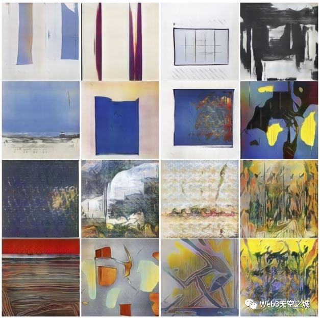

CAN模型生成作品里所体现的创造性让当时的开发研究人员都感到震惊，因为这些作品看起来和艺术圈子流行的抽象画非常类似。于是研究人员组织了一场图灵测试，请观众们去猜这些作品是人类艺术家的作品，还是人工智能的创作。

结果，53%的观众认为CAN模型的AI艺术作品出自人类之手，这在`历史上类似的图灵测试里首次突破半数`。

但CAN这个AI作画，仅限于一些抽象表达，而且就艺术性评分而言，还远远达不到人类大师的水平。更不用说创作出一些写实或者具象的绘画作品了，不存在的。

### 2021年：DALL-E系统，文生图

2021年初，OpenAI发布了广受关注的DALL-E系统，其AI绘画的水平也就一般，下面是DALL-E画一只狐狸的结果，勉强可以辨别。

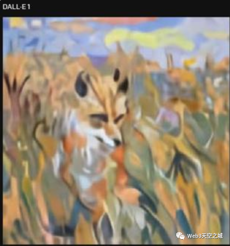

但值得注意的是，到了DALL-E这里，AI开始拥有了一个重要的能力，那就是可以按照文字输入提示来进行创作了！

### 小结

自深度学习模型的应用以及各互联网大厂的入局以来，AI绘画的发展突飞猛进。其中 OpenAI的 DALL-E 系统开创了一个使用文字创作图片的先河，从2021年到现在，是文字生图片迅猛发展的几年，于是AI绘画开始进入一个新的时代。

## 文字生成图片时代

### 2021年：图像分类CLIP模型

2021年1月，OpenAI `开源`了新的深度学习模型 [CLIP](https://github.com/openai/CLIP)（OpenAI, [Contrastive Language-Image Pre-Training](https://arxiv.org/abs/2210.08901))，一个当今最先进的图像分类人工智能。

CLIP训练AI同时做了两个事情：`自然语言理解`和`计算机视觉分析`。它被设计成一个有特定用途的能力强大的工具，那就是做通用的图像分类，CLIP可以决定图像和文字提示的对应程度，比如把猫的图像和"猫"这个词完全匹配起来。

CLIP模型的训练过程，简单的说，就是使用已经标注好的"文字-图像"训练数据，一方面对文字进行模型训练，一方面对图像进行另一个模型的训练，不断调整两个模型内部参数，使得模型分别输出的文字特征值和图像特征值能让对应的"文字-图像"经过简单验证确认匹配。

关键的地方来了，其实呢，之前也有人尝试过训练"文字-图像" 匹配的模型，但CLIP最大的不同是，它搜刮了40亿个"文本-图像"训练数据！通过这天量的数据，再砸入让人咂舌的昂贵训练时间，CLIP模型终于修成正果。

聪明的读者会问，这么多的"文本-图像"标记是谁做的呢? 40亿张啊，如果都需要人工来标记图像相关文字，那时间成本和人力成本都是天价。而这正是CLIP最聪明的地方，它用的是广泛散布在互联网上的图片! 

互联网上的图片一般都带有各种文本描述，比如标题，注释，甚至用户打的标签等等，这就天然的成为了可用的训练样本。

用这个特别机灵的方式, CLIP的训练过程完全避免了最昂贵费时的人工标注，或者说，全世界的互联网用户已经提前做了标注工作了。

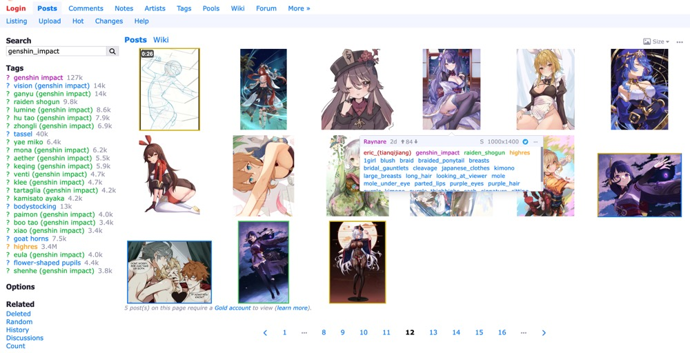

### 2022年：LAION-5B数据集

20222年3月，[LAION](https://laion.ai/projects/) 开源了当前最大规模的开源跨模态数据库 [LAION-5B](https://laion.ai/blog/laion-5b/)，包含接近60亿(5.85 Billion)个图片-文本对，可以被用来训练所有从文字到图像的的生成模型，也可以用于训练 CLIP这种用于给文本和图像的匹配程度打分的模型，而这两者都是现在 AI 图像生成模型的核心。

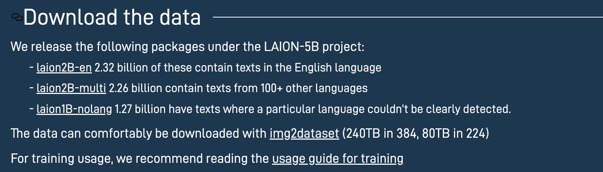

可从Hugging Face上的 [laion5B-index](https://huggingface.co/datasets/laion/laion5B-index/tree/main/metadata) 下载。

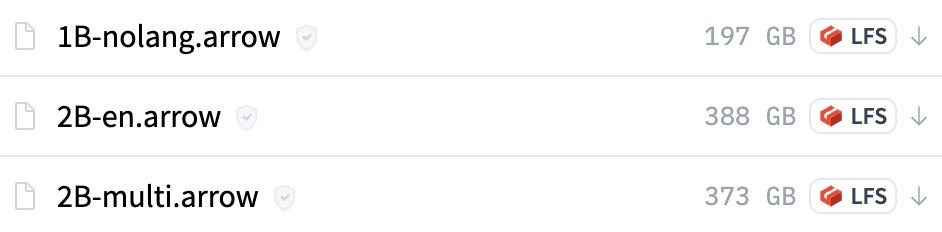

除了提供以上的海量训练素材库，LAION 还训练 AI 根据艺术感和视觉美感，给LAION-5B 里图片打分，并把得高分的图片归进了一个叫 [LAION-Aesthetics](https://github.com/LAION-AI/laion-datasets/blob/main/laion-aesthetic.md) 的子集。

事实上, 最新的AI绘画模型包括随后提到的AI绘画模型王者 Stable Diffusion都是利用 `LAION-Aesthetics` 这个高质量数据集训练出来的。

### CLIP+VQGAN

CLIP功能强大，但无论如何，它第一眼看上去，和艺术创作似乎没啥关系。

但就在CLIP开源发布几天后，一些机器学习工程师玩家就意识到，这个模型可以用来做更多的事情。比如Ryan Murdock，想出了如何把其他AI连接到CLIP上，来打造一个AI图像生成器。Ryan Murdock在接受采访时说：“在我把玩它几天后，我意识到我可以生成图像。”

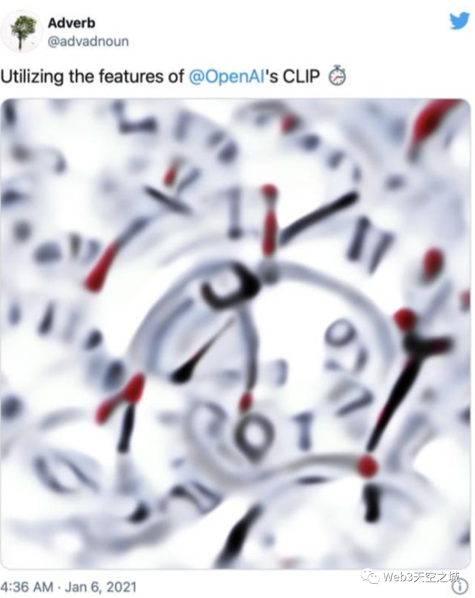

最终他选择了BigGAN, 一个GAN模型的变种, 并将代码发布为Colab笔记The Big Sleep。

随后，西班牙玩家 `@RiversHaveWings` 在此基础上发布了CLIP+VQGAN的版本和教程，这个版本通过Twitter被广为转发传播，引起了AI研究界和爱好者们的高度关注。而这个ID背后，正是现在所被熟知的计算机数据科学家 `Katherine Crowson`。

在之前，类似VQ-GAN这样的生成工具在对大量图像进行训练后，可以合成类似的新图像，然而，如读者还有印象, 前面说过, GANs类型的模型本身并不能通过文字提示生成新图像, 也不擅长创作出全新的图像内容.

而把CLIP嫁接到GAN上去生成图像，这其中的思路倒也简单明了：既然利用CLIP可以计算出任意一串文字和哪些图像特征值相匹配，那只要把这个匹配验证过程链接到负责生成图像的AI模型 (比如这里是VQ-GAN)，负责生成图像的模型反过来推导一个产生合适图像特征值，能通过匹配验证的图像，不就得到一幅符合文字描述的作品了吗?

有人认为 CLIP+VQGAN 是自2015年Deep Dream以来人工智能艺术领域最大的创新。而美妙的是，CLIP+VQGAN对任何想使用它们的人来说都是现成的。按照Katherine Crowson的线上教程和Colab Notebook，一个略懂技术的用户可以在几分钟内运行该系统。

### Diffusion模型

上面展示了一张 `CLIP+VQGAN` 模型生成的图片，因为GAN类模型的生成结果始终不尽如人意的原因，半年后被另外一种思路代替，那就是Diffusion模型(扩散化模型)。

如果复习一下GAN模型的工作原理, 其图像输出是内部生成器和判断器的PK妥协的结果。

Diffusion这个词也很高大上，但基本原理说出来大家都能理解，其实就是"去噪点". 对，就是我们熟悉的手机拍照(特别是夜景拍照)的自动降噪功能。如果把这个去噪点的计算过程反复进行，在极端的情况下，是不是可能把一个完全是噪声的图片还原为一个清晰的图片呢?

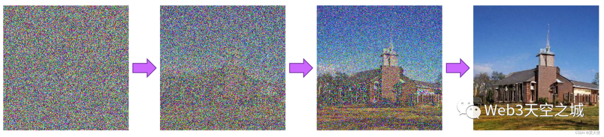

靠人当然不行，简单的去噪程序也不可能，但是基于AI能力去一边"猜"一边去噪，倒是可行的，这就是Diffusion扩散化模型的基本思路。

Diffusion扩散化模型目前在计算机视觉领域的影响力越来越大，它能够高效合成视觉数据，`图片生成完全击败了GAN模型`，而在其他领域如视频生成和音频合成也展现出了不俗的潜力。

## 2022进击的AI绘画

### Disco Diffusion

Disco Diffusion 是在今年 2 月初开始爆红的一个 AI 图像生成程序，它可以根据描述场景的关键词渲染出对应的图像:

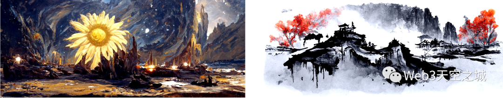

但Disco Diffusion的缺点还是有些明显，如身为专业艺术家的 Stijn Windig 反复尝试了Disco Diffusion，认为 Disco Diffusion 并没有取代人工创作的能力，核心原因有2点：
- Disco Diffusion 无法刻画具体细节，渲染出的图像第一眼很惊艳，但仔细观察就会发现大部分都是模糊的概括，达不到`商业细节水准`。
- Disco Diffusion的初步渲染时间是`以小时计算的`, 而要在渲染图像的基础上刻画细节，则相当于要把整个图重新画一遍，这样一个流程下来花耗费的时间精力，比直接手绘还要多。

其实从技术上来说，Stijn提出的两大痛点：1) AI绘画细节还不够深入 2) 渲染时间过长。实际上都是因为Diffusion扩散模型的一个内在缺点，这就是`反向去噪生成图片的迭代过程很慢，模型在像素空间中进行计算，这会导致对计算时间和内存资源的巨大需求，在生成高分辨率图像时变得异常昂贵`。

### Stable Diffusion

讲到这里, 当当当当, 当今世界最强大的AI绘画模型 Stable Diffusion终于闪亮登场了!

Stable Diffusion今年7月开始测试, 它非常好的解决了上述痛点。

实际上 `Stable Diffusion` 和之前的Diffusion扩散化模型相比，重点是做了一件事，那就是把模型的计算空间，从像素空间经过数学变换，在尽可能保留细节信息的情况下降维到一个称之为`潜空间(Latent Space)`的低维空间里，然后再进行繁重的模型训练和图像生成计算。

这个"简单"的思路转化, 带来了多大的影响呢?

基于潜空间的Diffusion模型与像素空间Diffusion模型相比，大大降低了内存和计算要求。比如Stable Diffusion所使用的潜空间编码缩减因子为8，说人话就是图像长和宽都缩减8倍，一个512x512的图像在潜空间中直接变为64x64，`节省了8x8=64倍的内存`!

这就是Stable Diffusion之所以又快又好的原因，它能快速(以秒计算)生成一张饱含细节的512x512图像，只需要一张消费级的8GB 2060显卡即可!

该模型由 [CompVis](https://github.com/CompVis)、[Stability AI](https://stability.ai/) 和 [LAION](https://laion.ai/) 于2022年8月开源在 [github](https://github.com/CompVis/stable-diffusion)，Stable Diffusion一经开源, 就始终霸占着GitHub热榜第一。

txt2img:  
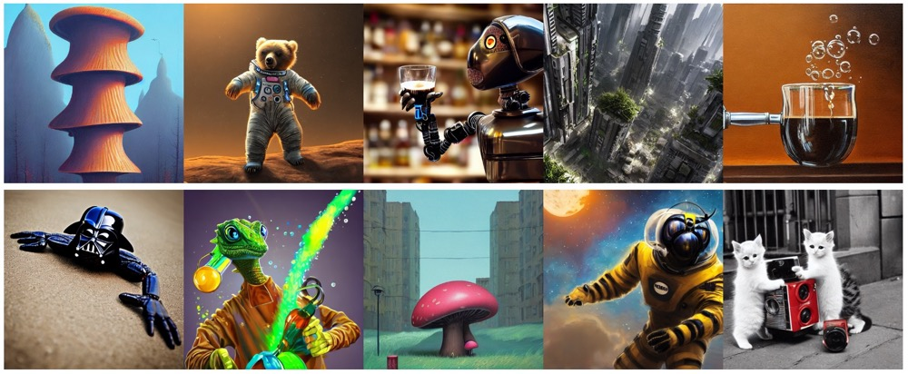

img2img:  
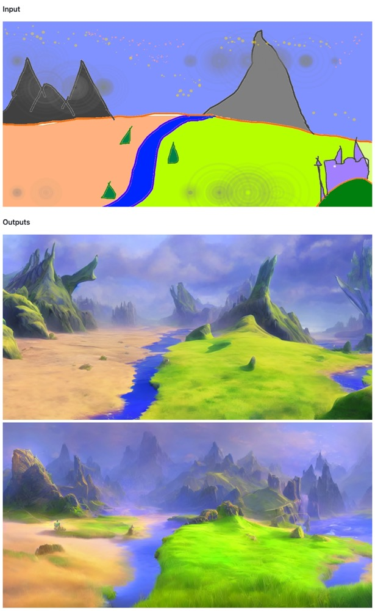

### 小结

目前 AI绘画的技术仍在不断变化发展中，其迭代之快，完全可以用"日新月异"来形容。即使把今年年初的AI绘画和现在相比，效果也有天壤之别。

在年初的时候，用Disco Diffusion可以生成一些很有氛围感的草图，但基本还无法生成人脸；仅仅2个月后，DALL-E 2已经可以生成准确的五官；现在，最强大的Stable Diffusion在画作的精致程度和作画速度上更是有了一个量级的变化。

AI绘画这项技术并不是近年才有的，但是今年以来，AI产出作品的质量以肉眼可见的速度日益提升，而效率也从年初的一个小时缩短到现在的十几秒。

# 参考

- [AI绘画何以突飞猛进? 从历史到技术突破，一文读懂火爆的AI绘画发展史](https://mp.weixin.qq.com/s/LsJwRMSqPXSjSyhoNgzi6w)
- [The Painting Fool](https://artelectronicmedia.com/en/artwork/the-painting-fool/)
- [Stable Diffusion](https://zh.wikipedia.org/wiki/Stable_Diffusion)
- [Generative Adversarial Networks (GANs)](https://www.clickworker.com/ai-glossary/generative-adversarial-networks/)